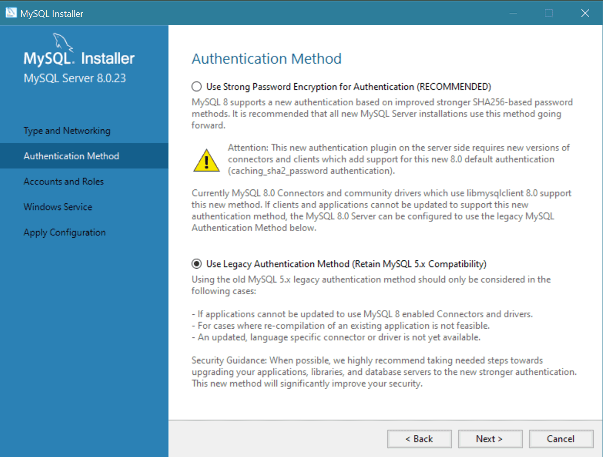

# Proyecto UniCine

Es una aplicación web desarrollada con **Spring Boot** que ofrece una plataforma integral para la gestión y experiencia de usuario en cines a nivel nacional en Colombia. Esta aplicación tiene como objetivo centralizar la información de múltiples salas de cine, permitiendo a los usuarios consultar carteleras, reservar entradas y gestionar sus experiencias cinematográficas de manera eficiente y amigable.

> [!CAUTION]
> En caso de existir alguna entidad real con el mismo nombre de la plataforma, esta aplicación no pretende representarla ni está afiliada de ninguna manera a dicha entidad. Cualquier similitud con nombres, marcas o servicios reales es pura coincidencia.

## Ejecucion

### Elementos Necesarios

#### MySQL

Descarge la ultima version del programa: [🔗](https://www.mysql.com/). En el proceso del desarrollo se implemento con la `8.0.35` pero no deberia existir problemas de compatibiliad en futuro se planteará la necesidad de implimentar docker para evitar estos problemas, dependiendo de como escale el proyecto.

> [!IMPORTANT]
> 1. Realize el proceso de instalación normalmente llegando al punto donde pregunte por el método de autenticación marque Legacy Authentication Method (MySQL 5.x Compatibility).

> [!NOTE]
> 2, Es necesario asignarle al root una contraseña que en caso de no hacerlo puede presentar problemar en la configuracion del archivo: [application.properties](https://github.com/CSBMStyles/Cine/blob/main/negocio/src/main/resources/application.properties) o de otro tipo.

#### JDK

Descargue el `JDK-21` en el enlace: [🔗](https://adoptium.net/es/) 

> [!NOTE]
> la version especifica es por el tema de las dependencias la configuracion esta en el [build.grable](https://github.com/CSBMStyles/Cine/blob/main/build.gradle)

### Entorno de Trabajo

En el caso de utilizar el IDE **Intellij Idea Ultimate**, no presenta problema en el proyecto ya que este cuenta con las extensiones necesarias pre-instaladas para trabajar.

> [!IMPORTANT]
> En el caso de utilizar el IDE **Visual Studio Code**, necesitamos instalar extensiones para trabajar con **Spring Boot**, afortunadamente existe un paquete que nos facilita el trabajo: [🔗](https://marketplace.visualstudio.com/items?itemName=vmware.vscode-boot-dev-pack)

> [!TIP]
> Ultimadamente al importar el proyecto en el IDE es necesario esperar un tiempo a que se inice el JDK e instalen las dependencias del `Gradle:Groovy`